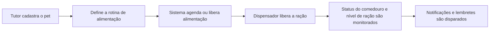

# PetPaparico


PetPaparico é uma solução web para gestão de alimentação de pets, com agendamento, monitoramento do comedouro, histórico de alimentação e alertas de manutenção.

O sistema foi pensado para facilitar a rotina de tutores, oferecendo automação, segurança e acompanhamento em uma interface simples e acessível.

## Visão geral

PetPaparico combina:

- gestão de pets e usuários
- alimentação manual e agendada
- histórico de consumo por pet
- monitoramento do nível de ração
- controle do dispensador e calibração do servo
- lembrete de limpeza do comedouro
- notificações de alimentação, ração baixa e manutenção
- integração com firmware ESP32 para o dispensador

## Como funciona



## Funcionalidades principais

- cadastro e gerenciamento de pets
- agendamento de refeições por horário
- histórico de alimentação por data
- monitoramento do nível de ração
- calibração do servo do dispensador
- alertas de ração baixa
- lembrete automático de limpeza do comedouro
- notificações do sistema para o tutor
- painel web para acompanhamento e gestão

## Principais recursos

<div align="center">

| Recurso | Descrição |
| --- | --- |
| Alimentação agendada | Planejamento de refeições por horário |
| Histórico | Acompanhamento do consumo por pet |
| Notificações | Alertas de alimentação, ração baixa e manutenção |
| Limpeza do comedouro | Lembrete configurável em intervalos definidos |
| ESP32 | Integração com firmware para dispensar ração |

</div>

## Stack tecnológica

- Python 3.12
- Django 6.0.4
- Django REST Framework
- PostgreSQL
- Tailwind CSS
- ESP32 + firmware Arduino

## Requisitos

- Python 3.12+
- pip
- virtualenv ou venv
- PostgreSQL 14+
- Arduino IDE para firmware ESP32 (opcional, quando houver hardware físico)

## Instalação

1. Clone o repositório:

```bash
git clone <url-do-repositorio>
cd PetPaparico
```

2. Crie e ative um ambiente virtual:

```bash
python3 -m venv .venv
source .venv/bin/activate
```

3. Instale as dependências:

```bash
pip install -r requirements.txt
```

4. Crie o banco PostgreSQL:

```bash
sudo -u postgres psql
```

No prompt do PostgreSQL:

```sql
CREATE USER petpaparico WITH PASSWORD 'troque-esta-senha';
CREATE DATABASE pet_feeder OWNER petpaparico;
\q
```

5. Configure as variáveis de ambiente. Copie o arquivo de exemplo e edite os valores:

```env
cp .env.example .env
```

No arquivo `.env`, defina:

```env
DJANGO_SECRET_KEY=gere-uma-chave-secreta-para-este-ambiente
DJANGO_DEBUG=True
DJANGO_ALLOWED_HOSTS=localhost,127.0.0.1,0.0.0.0
POSTGRES_DB=pet_feeder
POSTGRES_USER=petpaparico
POSTGRES_PASSWORD=troque-esta-senha
POSTGRES_HOST=127.0.0.1
POSTGRES_PORT=5432
```

O arquivo `.env` é ignorado pelo Git e não deve ser publicado.

6. Aplique as migrações do Django:

```bash
cd server_django
python3 manage.py migrate
```

## Execução

### Opção 1: via script

```bash
./start.sh
```

### Opção 2: execução manual

```bash
cd server_django
python3 manage.py runserver 0.0.0.0:8000
```

Acesse a aplicação em:

```text
http://localhost:8000/
```

## Estrutura do projeto

```text
PetPaparico/
├── README.md
├── requirements.txt
├── package.json
├── start.sh
├── TODO_COMPLETO.md
├── esp32_firmware/
│   ├── README.md
│   └── pet_feeder_esp32.ino
├── server_django/
│   ├── manage.py
│   ├── start.sh
│   ├── pet_feeder_django/
│   │   ├── __init__.py
│   │   ├── settings.py
│   │   ├── urls.py
│   │   ├── asgi.py
│   │   └── wsgi.py
│   └── api/
│       ├── admin.py
│       ├── apps.py
│       ├── models.py
│       ├── serializers.py
│       ├── urls.py
│       ├── views.py
│       ├── web_views.py
│       ├── servo_views.py
│       ├── iot_client.py
│       ├── notification_utils.py
│       ├── tests.py
│       ├── templates/
│       ├── static/
│       └── migrations/
├── .venv/
└── .gitignore
```

## Endpoints relevantes

- `/api/users/`
- `/api/pets/`
- `/api/schedules/`
- `/api/history/`
- `/api/device/status/`
- `/api/device/test/`
- `/api/feed/`
- `/api/servo/calibrate/`

## Páginas web

- `/`
- `/login/`
- `/register/`
- `/pets/`
- `/feeding/`
- `/history/`
- `/notifications/`
- `/device/`
- `/profile/`

## Firmware ESP32

O firmware do dispensador está localizado em:

- `esp32_firmware/pet_feeder_esp32.ino`

Essa parte do projeto é responsável pelo controle do servo, leitura de status e comunicação com a aplicação web.

## Observações

- O sistema foi estruturado para uso local em desenvolvimento e pode ser expandido para ambiente de produção.
- O PostgreSQL é o banco padrão. Para uma execução temporária com SQLite, defina `DJANGO_USE_SQLITE=True`.
- Bancos locais, dumps, credenciais, mídia enviada pelos usuários e arquivos de ambiente são ignorados pelo Git.
- Para uso em produção, revise configurações de banco, segurança, autenticação e variáveis de ambiente.

## Licença

Este projeto está disponível para uso e estudo. Ajuste a licença conforme a sua necessidade antes de publicar em ambiente público.
